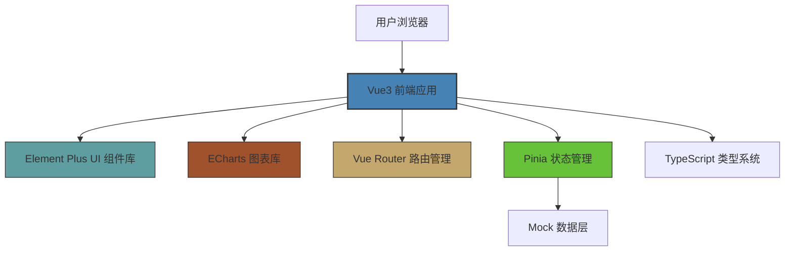
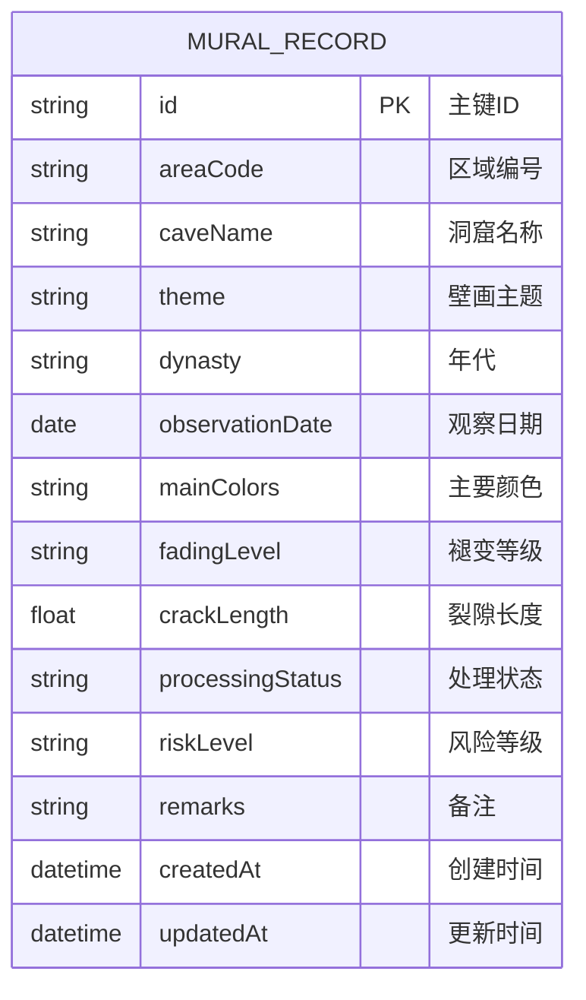

## 1. 架构设计



## 2. 技术描述

- **前端框架**：Vue 3.4 + Composition API + `<script setup>` 语法糖
- **开发语言**：TypeScript 5.4
- **构建工具**：Vite 5.2
- **UI 组件库**：Element Plus 2.7
- **图表库**：Apache ECharts 5.5
- **路由管理**：Vue Router 4.3
- **状态管理**：Pinia 2.1
- **样式方案**：SCSS + CSS Variables
- **图标库**：@element-plus/icons-vue
- **数据层**：前端 Mock 数据 + LocalStorage 持久化

## 3. 目录结构

```
/
├── .trae/documents/          # 项目文档
├── src/
│   ├── assets/               # 静态资源
│   │   ├── styles/           # 全局样式、变量
│   │   └── images/           # 图片资源
│   ├── components/           # 公共组件
│   │   ├── common/           # 通用组件
│   │   └── form/             # 表单组件
│   ├── composables/          # 组合式函数
│   ├── layouts/              # 布局组件
│   ├── router/               # 路由配置
│   ├── stores/               # Pinia 状态管理
│   ├── types/                # TypeScript 类型定义
│   ├── utils/                # 工具函数
│   ├── views/                # 页面视图
│   ├── App.vue               # 根组件
│   └── main.ts               # 入口文件
├── public/                   # 公共静态资源
├── index.html                # HTML 模板
├── vite.config.ts            # Vite 配置
├── tsconfig.json             # TypeScript 配置
├── tsconfig.node.json        # Node 环境 TypeScript 配置
└── package.json              # 项目依赖
```

## 4. 路由定义

| 路由路径 | 页面名称 | 说明 |
|----------|----------|------|
| `/` | 首页仪表板 | 数据概览和统计图表 |
| `/records` | 壁画记录列表 | 壁画区域列表、筛选、表格 |
| `/records/new` | 新增记录 | 新建壁画观察记录 |
| `/records/:id` | 记录详情 | 查看单条记录详情 |
| `/records/:id/edit` | 编辑记录 | 编辑已有记录 |

## 5. 数据模型

### 5.1 数据模型定义



### 5.2 类型定义

```typescript
// 褪变等级
export type FadingLevel = 'none' | 'mild' | 'moderate' | 'severe'

// 处理状态
export type ProcessingStatus = 'pending' | 'processing' | 'completed'

// 风险等级
export type RiskLevel = 'low' | 'medium' | 'high'

// 壁画记录
export interface MuralRecord {
  id: string
  areaCode: string
  caveName: string
  theme: string
  dynasty: string
  observationDate: string
  mainColors: string
  fadingLevel: FadingLevel
  crackLength: number
  processingStatus: ProcessingStatus
  riskLevel: RiskLevel
  remarks: string
  createdAt: string
  updatedAt: string
}

// 筛选条件
export interface FilterParams {
  caveName?: string
  dynasty?: string
  riskLevel?: RiskLevel | ''
  processingStatus?: ProcessingStatus | ''
  keyword?: string
}

// 统计数据
export interface DashboardStats {
  totalRecords: number
  pendingCount: number
  highRiskCount: number
  monthlyNewCount: number
  riskDistribution: { name: string; value: number }[]
  dynastyDistribution: { name: string; value: number }[]
  fadingTrend: { date: string; count: number }[]
  processingProgress: { name: string; value: number }[]
}
```

## 6. 状态管理设计

### 6.1 Mural Store
- `records: MuralRecord[]` - 壁画记录列表
- `currentRecord: MuralRecord | null` - 当前选中的记录
- `filterParams: FilterParams` - 筛选参数
- `loading: boolean` - 加载状态
- `getFilteredRecords` - 获取筛选后的记录
- `getRecordById` - 根据ID获取记录
- `addRecord` - 新增记录
- `updateRecord` - 更新记录
- `deleteRecord` - 删除记录
- `calculateRiskLevel` - 计算风险等级
- `getDashboardStats` - 获取仪表板统计数据

## 7. 关键技术实现

### 7.1 风险等级自动计算规则
- 褪变等级为"严重" 或 裂隙长度 > 50cm → 高风险
- 褪变等级为"中度" 或 裂隙长度 20-50cm → 中风险
- 其他情况 → 低风险

### 7.2 ECharts 图表组件封装
- 统一图表容器组件，支持响应式
- 封装常用图表类型（饼图、柱状图、折线图、环形图）
- 统一配置主题色，与整体设计风格一致

### 7.3 表单验证规则
- 区域编号：必填，格式校验（如 MOG-001）
- 洞窟名称：必填，最大长度50
- 壁画主题：必填，最大长度100
- 年代：必填，下拉选择
- 观察日期：必填，日期选择
- 褪变等级：必填，下拉选择
- 裂隙长度：数字，≥0
- 处理状态：必填，下拉选择

### 7.4 Mock 数据策略
- 生成 20+ 条真实感测试数据
- 覆盖各个朝代、各类风险等级
- 包含历史时间线数据用于趋势图表
- 使用 faker.js 或手写真实数据
