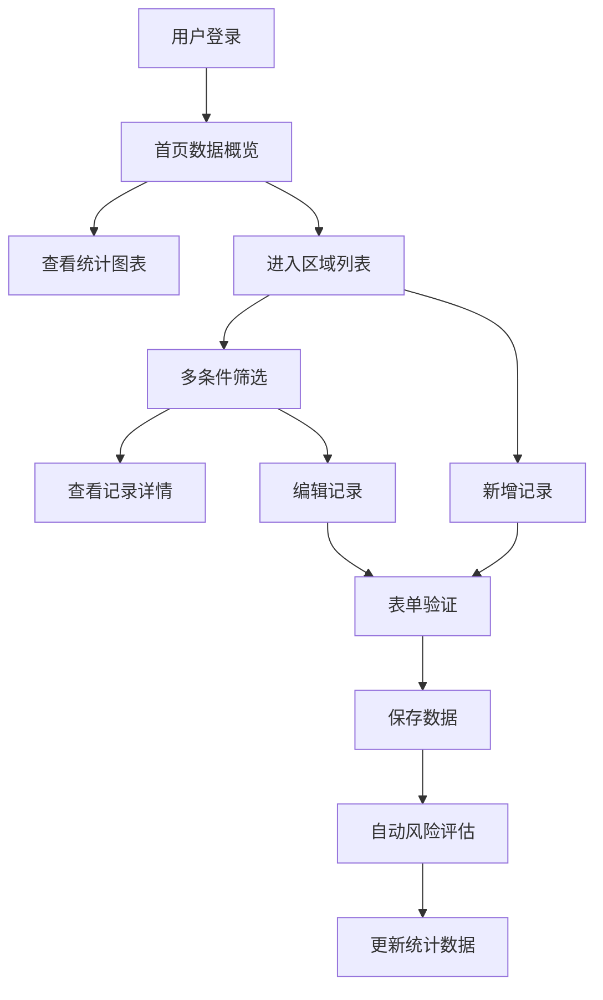

## 1. 产品概述

石窟壁画保护记录系统是专为文物保护人员设计的数字化管理平台，用于记录和跟踪石窟壁画不同区域的色彩褪变、裂隙变化和保护处理进度。系统通过可视化图表和结构化数据管理，帮助文保人员高效开展壁画监测与保护工作。

- 核心目标：实现壁画保护记录的数字化、标准化和可视化管理
- 目标用户：文物保护研究人员、石窟管理机构、文化遗产保护工作者
- 核心价值：提升保护工作效率，留存历史观测数据，辅助保护决策

## 2. 核心功能

### 2.1 用户角色
| 角色 | 登录方式 | 核心权限 |
|------|----------|----------|
| 文保人员 | 账号密码登录 | 记录增删改查、数据筛选、统计查看、风险标记 |
| 管理员 | 账号密码登录 | 全部功能权限、用户管理、数据导出 |

### 2.2 功能模块
1. **首页统计仪表板**：数据概览卡片、多维度统计图表、风险预警提示
2. **壁画区域列表**：数据表格展示、多条件筛选、风险等级标识
3. **新增/编辑记录**：表单录入、数据校验、图片上传
4. **观察记录详情**：历史记录追溯、变化趋势对比
5. **风险等级管理**：自动风险评估、颜色标记、预警提示

### 2.3 页面详情
| 页面名称 | 模块名称 | 功能描述 |
|-----------|-------------|---------------------|
| 首页仪表板 | 数据概览卡片 | 总记录数、待处理数、高风险数、本月新增 |
| 首页仪表板 | 统计图表 | 风险等级分布饼图、年代分布柱状图、褪变趋势折线图、处理进度环形图 |
| 壁画区域列表 | 筛选区域 | 按洞窟名称、年代、风险等级、处理状态筛选 |
| 壁画区域列表 | 数据表格 | 展示全部字段、支持排序、操作列 |
| 新增/编辑记录 | 表单组件 | 完整字段录入、表单验证、提交/取消 |
| 记录详情页 | 信息展示 | 完整信息展示、历史版本对比 |

## 3. 核心流程

文保人员登录系统后，首先在首页查看数据概览和统计图表，了解整体保护状况。通过筛选条件定位需要关注的壁画区域，查看详细记录和历史变化。当进行现场勘察时，可新增记录或编辑已有记录，系统自动计算风险等级并更新统计数据。

## 4. 用户界面设计

### 4.1 设计风格
- **主色调**：敦煌土黄 `#C4A76C`、赭石红 `#A0522D`，体现文化遗产厚重感
- **辅助色**：石青 `#4682B4`、石绿 `#5F9EA0`，呼应壁画矿物颜料
- **风险色**：低风险绿 `#67C23A`、中风险黄 `#E6A23C`、高风险红 `#F56C6C`
- **按钮风格**：圆角矩形，轻微阴影，hover 状态有颜色加深效果
- **字体**：标题使用 Noto Serif SC 体现文化感，正文使用 Inter 保证可读性
- **布局风格**：卡片式布局，顶部导航 + 左侧菜单 + 主内容区
- **图标**：使用 Element Plus 图标库，统一线性风格

### 4.2 页面设计概述
| 页面名称 | 模块名称 | UI 元素 |
|-----------|-------------|-------------|
| 首页仪表板 | 数据卡片 | 渐变背景、图标动画、数字滚动效果 |
| 首页仪表板 | 图表区域 | 网格布局、ECharts 响应式图表、卡片阴影 |
| 区域列表 | 筛选栏 | 行内表单、紧凑布局、重置按钮 |
| 区域列表 | 数据表格 | 斑马纹、风险等级标签、操作按钮组 |
| 表单页面 | 录入表单 | 分组布局、必填标识、错误提示、下拉选择 |

### 4.3 响应式
- 采用桌面优先设计，适配 1440px、1920px 主流分辨率
- 侧边栏可折叠，主内容区自适应宽度
- 表格在小屏幕下支持横向滚动
- 触控设备优化按钮点击区域

## 5. 数据字段说明

| 字段名 | 类型 | 说明 | 必填 |
|--------|------|------|------|
| 区域编号 | String | 唯一标识，如 MOG-001 | 是 |
| 洞窟名称 | String | 如第257窟 | 是 |
| 壁画主题 | String | 如九色鹿本生 | 是 |
| 年代 | String | 如北魏、唐代 | 是 |
| 观察日期 | Date | 记录日期 | 是 |
| 主要颜色 | String | 如石青、赭红 | 否 |
| 褪变等级 | Enum | 无/轻微/中度/严重 | 是 |
| 裂隙长度 | Number | 单位：厘米 | 否 |
| 处理状态 | Enum | 未处理/处理中/已完成 | 是 |
| 备注 | Text | 详细描述 | 否 |
| 风险等级 | Enum | 低/中/高 | 自动计算 |
